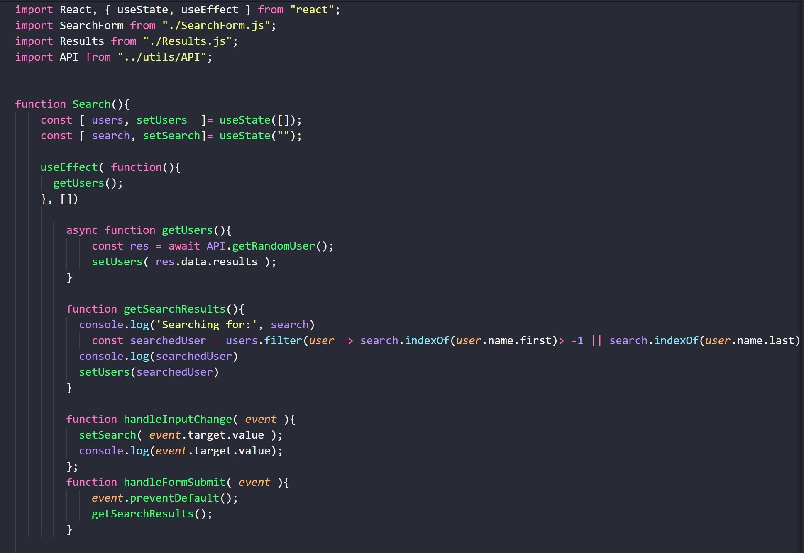
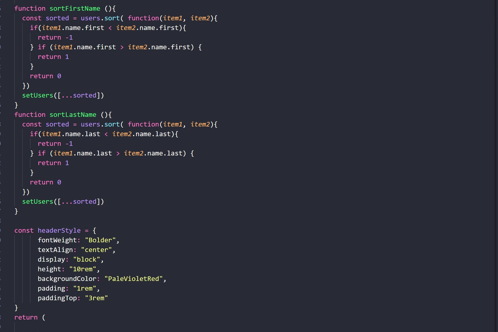
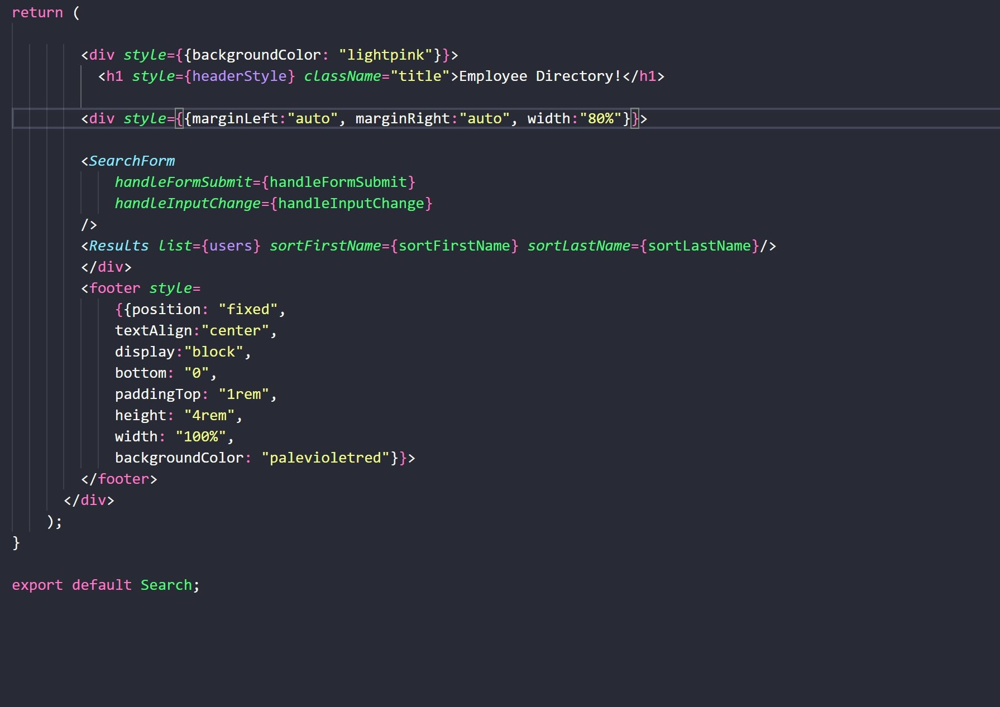
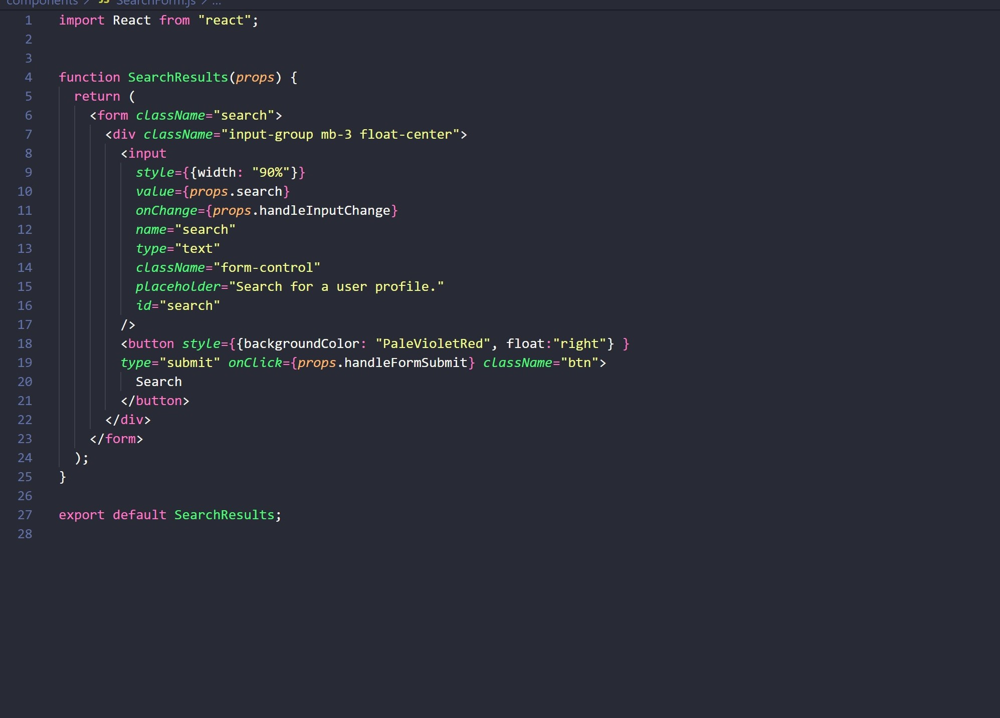
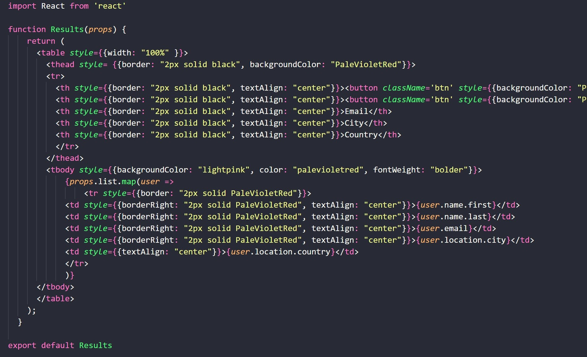
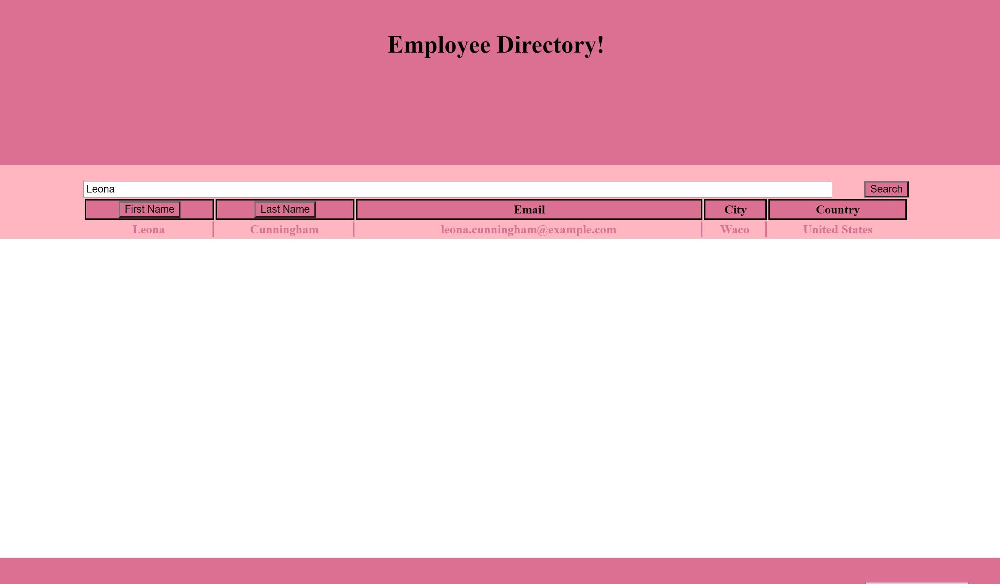

# Unit 11 Express Homework: Note Taker
# Project #2 Chatter Ladder

## **Table of Contents** 

  - [Description](#description)
  - [Elements](#elements)
  - [Installation Instructions](#installation)
  - [Usage](#usage)
  - [Contributors](#contributors)
  - [Aids](#aids)
  - [Links](#links)

## **Description**
For this project we were asked to create an employee directory using REACT that could take a list of random users and search through them.

## **Elements**

For this project we needed to create certain components including a list of users, a search form, a directory in table format, and buttons that would allow you to order the list.

The index and app pages were not changed for this project. the App page is connected to the directory page.

DIRECTORY

In the directory page is used to get random users from the API page, get search results from the search form, and handle the input and form submit.

SEARCH FORM

RESULTS

## **Installation Instructions**
Dependencies Required
React
react-dom
axios
react-scripts

## **Usage**

Ordered by First Name

Ordered by Last Name

Search By First Name

Search By Last Name

## **Contributors**
This project was done by:

Leah O'Gorman -- https://github.com/leahogorman

## **Aids**
research was done by searching react, w3schools and stackoverflow

https://www.w3schools.com/

https://stackoverflow.com/

https://reactjs.org/

Additionally the project was done with aid from our instructors

Fil -- https://github.com/c0dehot

Daniel Ceballos -- https://github.com/shibeknight

## **Links**

The Heroku live link is: https://polar-island-87219.herokuapp.com/

The Github link is: https://github.com/leahogorman/Employee-Directory
                    https://leahogorman.github.io/Employee-Directory/

